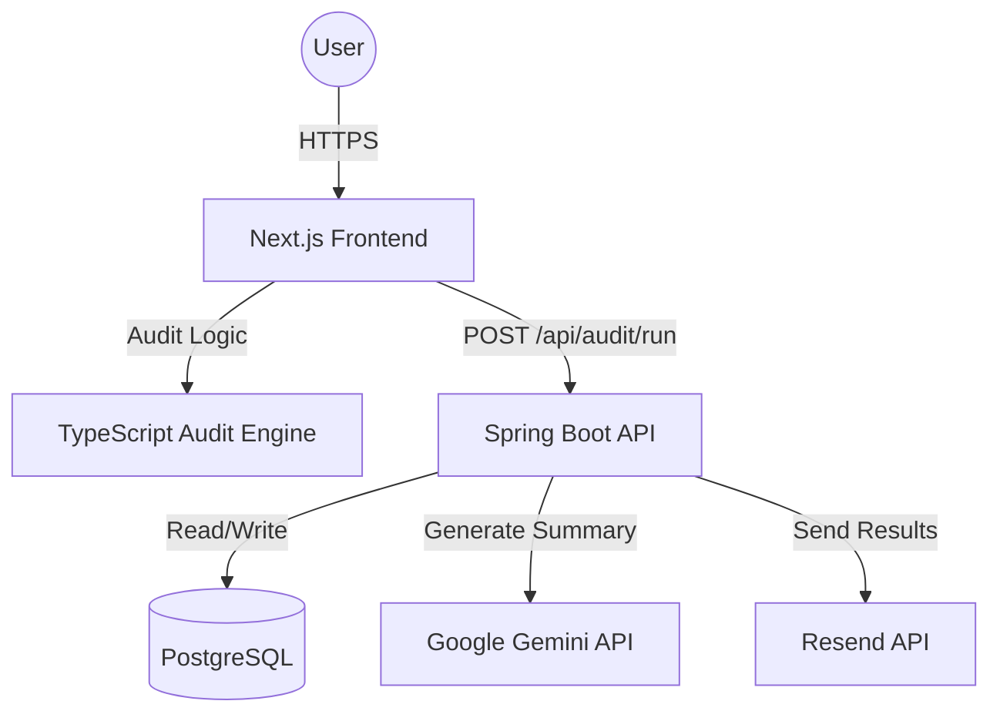

# SpendLens Architecture

## System Diagram

## Data Flow
1. **Input**: User enters tool data and team size on the Next.js frontend.
2. **Local Calc**: The `audit-engine.ts` (TypeScript) calculates savings immediately for UI responsiveness.
3. **Persist**: The full `AuditRequest` (including the calculated results) is sent to the Spring Boot backend.
4. **Enrich**: Spring Boot calls the Gemini API to generate a personalized executive summary based on the results.
5. **Store**: The audit, summary, and IP-hashed metadata are stored in PostgreSQL.
6. **Delivery**: If the user provides an email, the Resend API triggers a report delivery.

## Technology Stack Selection

- **Next.js + Tailwind**: Allows the frontend team to iterate on the UI/UX at high velocity. The "Audit Engine" is shared between the UI and the data layer via TypeScript.
- **Spring Boot 3 + Java 21**: Provides type-safe API contracts, built-in connection pooling (HikariCP), and mature rate-limiting via **Bucket4j**. This ensures the backend remains stable under burst traffic.
- **PostgreSQL**: Reliable persistence for audit history and lead generation data.

## Scaling to 10k Audits/Day

To handle significant scale, the following architectural upgrades are planned:
- **Rate Limiting**: Replace the current in-memory `Bucket4j` with a Redis-backed implementation to handle distributed rate limiting across multiple API instances.
- **Database**: Implement read replicas for the `audits` table to handle high-volume dashboard views.
- **Async Processing**: Move the Gemini API and Resend API calls to an asynchronous job queue (e.g., RabbitMQ or Spring @Async with a dedicated executor) to keep the `/run` endpoint response time under 200ms.
- **Caching**: Implement a CDN for the Results page and use a library like `satori` to generate OpenGraph images for every audit, allowing users to share their savings on social media efficiently.
